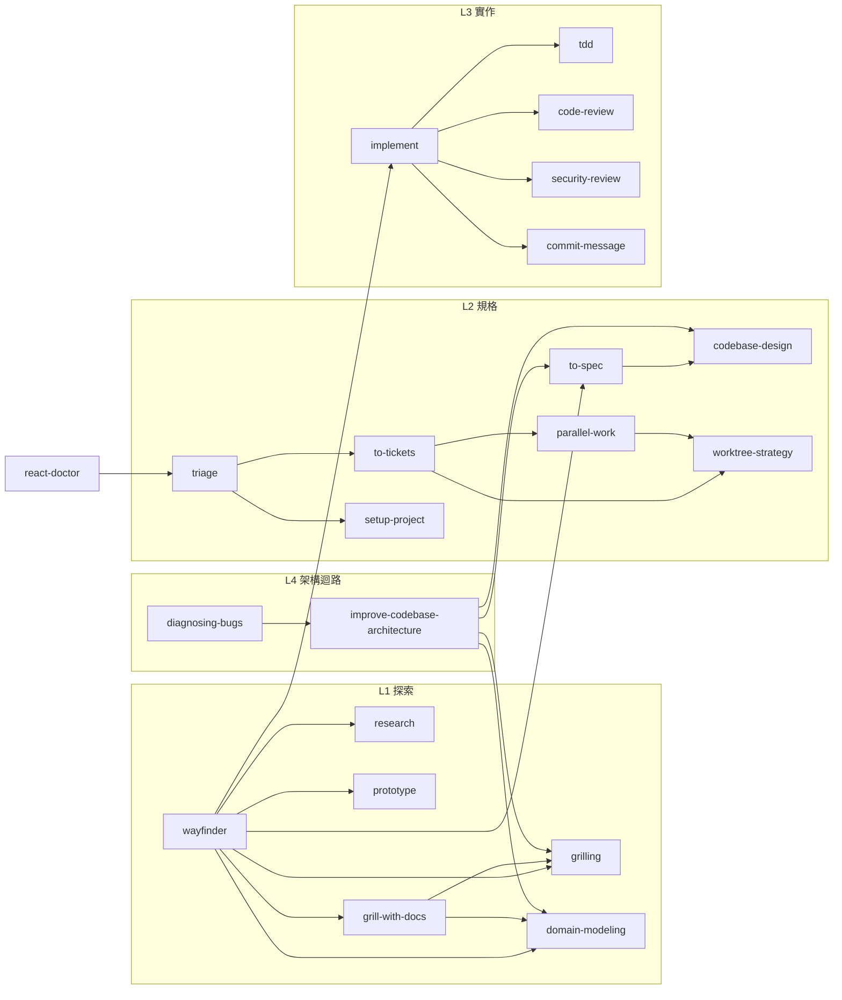

# Harness 細節：`skills/`、`agents/` 與它們的呼叫關係

> 從 [`../README.md`](../README.md) 拆出來的細節。README 只留架構與索引，
> 這裡放 31 個 skill 的分類、實際引用圖、多檔 skill 的設計理由，以及 4 個 subagent 的責任。

## 1. `skills/` 分類

Skill 的 frontmatter **只有 `name` 與 `description` 兩個欄位，兩個都必填**。`description` 是 agent 判斷是否啟用的唯一依據，所以要同時寫清楚 **what** 與 **when**。Skills 走 progressive disclosure：預設只把 name 與 description 注入 context，命中才展開全文。

### 軸 A — 誰能啟動

| 模式 | 數量 | 成員 | 怎麼約束 |
|---|---|---|---|
| **只有使用者能叫**（orchestration） | 11 | `workflow` `setup-project` `wayfinder` `grill-with-docs` `to-spec` `to-tickets` `implement` `triage` `improve-codebase-architecture` `create-pull-request` `handoff` | 正文第一句：「這個 skill 只在使用者明確要求時執行。不要在使用者沒要求時自行啟動它。」 |
| **內部紀律**（給其他 skill 內嵌） | 1 | `grilling` | 正文第一句：「這是給其他 skill 內嵌使用的訪談紀律，本身不產出 spec、ticket 或程式碼。」 |
| **兩者都可以**（discipline） | 19 | 其餘全部 | 無額外約束 |

為什麼要分：使用者專用的 skill 會**改變工作階段**（開始實作、發布 spec、建立 PR）。模型不能自己跳進去——否則一句「幫我看看」就變成自動開 PR。反之 `tdd`、`code-review` 這類純紀律，模型該用就用。

> 🔴 **上表的約束是軟約束，不要當成強制。** Antigravity 的 skill frontmatter 只有 `name` 與 `description`，
> **沒有任何能結構性禁止模型自行啟動 skill 的欄位**，也沒有等價機制。所以那 11 個 skill 的限制只存在於
> SKILL.md 正文的文字裡——模型可以違反。同一條規則另外寫在 [`../../AGENTS.md`](../../AGENTS.md)
> 〈Skills 的角色〉，用重複提高遵守率，但仍然不是強制。
>
> ⚠️ 官方網站把「使用者專用」歸給 Workflows 而非 Skills，但 `agy` 1.1.12 binary 內**查無 `.agents/workflows` 字串**，CLI 是否支援 workspace workflows 未載明。在能實測之前，本 repo 不使用 workflows。

### 軸 B — 功能分層

| 層 | Skills | 解決什麼 |
|---|---|---|
| **L0 基座** | `setup-project` `workflow` | 契約從哪來、現在該走哪條路 |
| **L1 探索與決策** | `wayfinder` `grill-with-docs` `grilling` `domain-modeling` `research` `prototype` | 還不知道要做什麼 |
| **L2 規格與切票** | `to-spec` `to-tickets` `triage` | 知道要做什麼，還沒切成可執行單位 |
| **L3 實作** | `implement` `tdd` `codebase-design` `improve-codebase-architecture` | 寫程式 |
| **L4 驗證** | `code-review` `security-review` `diagnosing-bugs` `react-doctor` `test` `build-check` | 證明它對 |
| **L5 Git 與交付** | `branch-name` `commit-message` `create-pull-request` `release-notes` `resolving-merge-conflicts` `worktree-strategy` `parallel-work` | 把成果送出去 |
| **L6 環境與 session** | `running-local-docker-stack` `handoff` `adhd-dev-mode` | 讓前面幾層跑得動 |

`test` 與 `build-check` 是**零判斷、零副作用**的 Quality command shortcut：命令一律從專案契約讀，沒設定就回報 `unknown` 而不猜測。Antigravity **沒有獨立的 commands 層**——它們就是兩個正常的 skill，只是內容特別短。凡是需要判斷（何時該用哪個 skill、要不要拆單）的一律寫成完整 skill，不要複製一份精簡流程。

---

## 2. 呼叫關係

主線（[`../../AGENTS.md`](../../AGENTS.md) 與 `workflow/SKILL.md` 定義）：

```text
迷霧太大 ─▶ wayfinder ─┐
                       ├─▶ grill-with-docs ─▶ to-spec ─▶ to-tickets ─▶ implement
需求已清楚 ────────────┘                                        │
                                                                ├─ tdd（每個 slice）
                                                                ├─ code-review（收尾，必跑）
                                                                └─ security-review（碰敏感面才跑）
```

下圖只畫**skill 正文裡實際出現的引用**（箭頭 = 前者在流程中指定使用後者）。上面主線的 `to-spec → to-tickets → implement` 三段只寫在 `workflow` 這個 router 裡，個別 skill 的正文並不互相串接——這是刻意的，讓每一段都能單獨使用。



三個值得注意的性質：

1. **`workflow` 是唯一的全域索引**，它引用 23 個 skill 但沒有任何 skill 引用它——路由器不參與流程。它自己也只輸出三行（建議路徑／證據／翻盤條件），不代替使用者啟動下一個 skill。
2. **`grilling` 是唯一的純被叫者**：`grill-with-docs`、`wayfinder`、`improve-codebase-architecture` 都靠它做「一次一題」的訪談迴圈。這是刻意的——訪談紀律要嵌在有目的的流程裡，不是單獨一個聊天模式。
3. **`diagnosing-bugs → improve-codebase-architecture → codebase-design → to-spec` 形成回饋環**：修 bug 時發現的架構摩擦，會被導回規格階段，而不是就地擴大 diff。

---

## 3. 多檔 skill：`references/` 的三種角色

31 個 skill 中只有 3 個有附檔。SKILL.md 一旦觸發就整份進 context，所以**附檔存在的唯一理由是延後載入**——SKILL.md 只放「每次都要判斷的東西」，`references/` 放「走到那個分支才需要的東西」。官方建議的目錄名就是 `references/`（另有選用的 `scripts/`、`examples/`、`resources/`，本 repo 未使用）。

三個多檔 skill 剛好示範三種不同的附檔角色：

### A. 分支程序 — `codebase-design/`

```text
SKILL.md              共用詞彙（module / interface / depth / seam / adapter / leverage / locality）
   │                  + deletion test 等判斷準則                      ← 每次都要
   └── references/
       ├── DESIGN-IT-TWICE.md   新 interface 時：產至少兩個結構不同的方案並比較
       └── DEEPENING.md         既有 cluster 時：畫 cluster → 選 seam → replace 不 layer → 保持綠燈
```

兩個附檔是**互斥分支**：要新建 interface 走前者，要改造既有程式走後者。SKILL.md 只負責判斷走哪邊。`DESIGN-IT-TWICE.md` 還會再往下派工——把每個方案交給獨立 subagent，彼此看不到對方，避免趨同。

### B. 輸出模板 — `domain-modeling/`

```text
SKILL.md              訪談與收斂領域語言的紀律                        ← 每次都要
   └── references/
       ├── CONTEXT-FORMAT.md    要寫 glossary 時的 CONTEXT.md 版型
       └── ADR-FORMAT.md        要寫 ADR 時的版型（含編號規則）
```

兩個附檔是**寫檔當下才需要的格式**，而且有明確門檻：ADR 只在「難逆轉 + 缺脈絡會令人意外 + 存在真實取捨」三條件同時成立時才提議。模板放外面，避免每次談領域都把兩份版型塞進 context。

### C. 判準範例 — `tdd/`

```text
SKILL.md              red → green → refactor 的執行順序與 seam 選擇   ← 每次都要
   └── references/
       ├── tests.md             好測試 vs 壞測試的對照範例（行為 vs 互動）
       └── mocking.md           可替換 / 不可替換的清單
```

兩個附檔都在回答同一個問題——「這個測試寫得對嗎」——但用**範例與清單**而非規則。這類內容篇幅大、只在爭議時需要，所以外置。

| 附檔角色 | 何時載入 | 例子 |
|---|---|---|
| 分支程序 | 判斷完走哪條路之後 | `DEEPENING.md` `DESIGN-IT-TWICE.md` |
| 輸出模板 | 真的要寫檔之前 | `CONTEXT-FORMAT.md` `ADR-FORMAT.md` |
| 判準範例 | 品質有爭議時 | `tests.md` `mocking.md` |

其餘 28 個 skill 都是單檔，因為它們的流程能在 15–60 行內講完。**附檔不是章節切分，是條件式載入**；如果一份附檔每次都會被讀，它就該併回 SKILL.md。

---

## 4. `agents/`：把 context 汙染隔離出去

每個 subagent 是一個**目錄**，定義檔是 `<name>/agent.md`，frontmatter 只有 `name` 與 `description`。

| Agent | 被誰呼叫 | 職責 | 輸出上限 |
|---|---|---|---|
| `code-explorer` | `improve-codebase-architecture` | 定位實作、呼叫關係、設定與測試 | 20 行 |
| `standards-reviewer` | `code-review` | repo 標準、程式異味、測試品質 | 5 項 |
| `spec-reviewer` | `code-review` | 漏做、做錯、scope creep | 5 項 |
| `security-reviewer` | `security-review`、`code-review`（碰敏感面時） | 入口 → 路徑 → 影響的攻擊路徑 | 5 項 |

**雙軸互不可見。** `code-review` 平行呼叫 `standards-reviewer` 與 `spec-reviewer`，兩者看不到對方輸出，聚合時分開呈現、各自保留嚴重度排序，不跨軸選單一冠軍。理由：合併會讓一軸的「通過」洗掉另一軸的問題。Security 也不併進前兩軸。

> ⚠️ **兩個必須知道的落差。**
>
> 1. **檔案格式未載明。** `.agents/agents/` 這條路徑由 binary 字串確認存在，`<name>/agent.md` 的檔名來自 binary 常數 `writing agent.md`（高信心推論，尚未端到端實測；`agy agents` 子命令本機零輸出，無法用來驗收）。官方文件與內建規格都沒有 agents 章節。因此 `code-review` 與 `security-review` 都寫了 fallback：subagent 定義載不進來時，改為在乾淨 context 分次獨立審查，且第二軸開始前不得讀第一軸結論。
> 2. **唯讀只是文字約束。** Antigravity 的 agent frontmatter 只有 `name` 與 `description`；binary 的 87 個 `yaml:"…"` struct tag 中查無 `tools`、`disallowedTools`、`permissionMode`、`color`（已驗證的負面結論）。所以這 4 個 agent 的唯讀性質只由各自正文的〈唯讀邊界〉段落約束。**要硬性阻擋寫入，目前唯一可驗證的做法是 `.agents/hooks.json` 的 PreToolUse guard**（見 [`harness-guardrails.md`](./harness-guardrails.md)）。
>
> 同理，`standards-reviewer` 對 `codebase-design` 的依賴無法寫在 frontmatter（沒有這種欄位），改成在正文用相對路徑明指 `codebase-design/SKILL.md`。
