# Management Frameworks

Diagnose a management problem and recommend a framework from the knowledge base in [frameworks.md](./frameworks.md) — six categories, ~60 frameworks.

## Diagnosis loop

1. Take the problem as the user states it. Map it onto the decision tree below and walk to a leaf.
2. Branch ambiguous → ask **one** clarifying question, then commit. Never walk the user through the tree question by question.
3. Leaf reached → open `frameworks.md` and read **only the matched category's section**, then build the recommendation.
4. No leaf fits → say plainly that the knowledge base has no matching framework. Never force a fit.

## Hard rules

- **Selection is closed, explanation is open.** Recommend only frameworks that exist in the knowledge base — never invent one or import one from outside. Applying the pick to the user's concrete situation may draw on general knowledge.
- Facts about a framework (origin, steps, pitfalls, cases) come from the table, not memory.

## Output shape

Prose, never a table dump. Four things:

1. **The framework** — English and Chinese name together, e.g. "OKR（目標與關鍵結果）".
2. **Why this one** — one line tracing the decision path: "you need alignment plus stretch → OKR".
3. **How to start** — the table's usage steps rewritten into the user's context, not copied.
4. **Watch out** — only the one or two pitfalls that bite in *their* situation.

Two leaves genuinely close → add a runner-up plus one line on the difference ("if this is really about tying goals to performance appraisal, MBO fits better"). Origin, notable cases, and reach stay in the table — surface them only when asked.

## Decision tree

```mermaid
graph TD
    Start{Primary management need?}
    Start --> C1(Goal setting)
    Start --> C2(Strategy & innovation)
    Start --> C3(Problem solving)
    Start --> C4(Process improvement)
    Start --> C5(Communication & decisions)
    Start --> C6(Project & team)

    C1 --> Q1{Grand long-term vision, or concrete performance goal?}
    Q1 -- "10-30 year vision" --> BHAG[(BHAG)]
    Q1 -- "Concrete goal" --> Q1b{What matters most?}
    Q1b -- "Org-wide alignment + stretch" --> OKR[(OKR)]
    Q1b -- "Tied to performance appraisal" --> MBO[(MBO)]
    Q1b -- "Goal itself clear, measurable, realistic" --> SMART[(SMART)]
    Q1b -- "Decompose vision into action" --> GP[(Goal Pyramid)]
    Q1b -- "Objective quantitative tracking" --> KPI[(KPI)]
    Q1b -- "Ignite intrinsic motivation" --> HARD[(HARD Goals)]

    C2 --> Q2{Starting point of the analysis?}
    Q2 -- "Macro environment (politics/economy/society...)" --> PESTEL[(PESTEL)]
    Q2 -- "Industry competitive structure" --> P5[(Porter's Five Forces)]
    Q2 -- "Quick internal/external snapshot" --> SWOT[(SWOT)]
    Q2 -- "Internal product/business portfolio" --> BCG[(BCG Matrix)]
    Q2 -- "Four growth paths" --> ANSOFF[(Ansoff Matrix)]
    Q2 -- "Design or innovate the business model" --> BMC[(Business Model Canvas)]
    Q2 -- "Escape competition, create a new market" --> BLUE[(Blue Ocean)]
    Q2 -- "User-centered product/service innovation" --> DT[(Design Thinking)]
    Q2 -- "Validate an idea at minimal cost" --> LS[(Lean Startup)]
    Q2 -- "Improve something that already exists" --> SCAMPER[(SCAMPER)]
    Q2 -- "Disrupt from fundamentals" --> FP[(First Principles)]

    C3 --> Q3{Main purpose?}
    Q3 -- "Quickly find the root cause" --> W5[(5 Whys)]
    Q3 -- "Systematically brainstorm all causes" --> FISH[(Fishbone)]
    Q3 -- "Structured MECE decomposition" --> IT[(Issue Tree / MECE)]
    Q3 -- "Multi-angle team thinking" --> HATS[(Six Thinking Hats)]
    Q3 -- "Rigorous standardized process" --> Q3b{Context?}
    Q3b -- "Manufacturing quality complaints" --> D8[(8D)]
    Q3b -- "Data-driven defect elimination" --> DMAIC[(DMAIC)]
    Q3b -- "Technical contradictions" --> TRIZ[(TRIZ)]
    Q3 -- "Build a continuous improvement loop" --> PDCA[(PDCA)]

    C4 --> Q4{Improvement goal?}
    Q4 -- "Eliminate waste (waiting/inventory/motion)" --> LEAN[(Lean)]
    Q4 -- "Cut defects and variability hard" --> SS[(Six Sigma)]
    Q4 -- "Find and break the system bottleneck" --> TOC[(Theory of Constraints)]
    Q4 -- "Everyone-participates improvement culture" --> KAIZEN[(Kaizen)]
    Q4 -- "Organize the physical workplace" --> S5[(5S)]
    Q4 -- "Visualize and manage team workflow" --> KANBAN[(Kanban system)]
    Q4 -- "Analyze the end-to-end value stream" --> VSM[(VSM)]

    C5 --> Q5{Core need?}
    Q5 -- "Structured persuasive presentation/writing" --> PYR[(Pyramid Principle / SCQA)]
    Q5 -- "Prioritize the to-do list" --> EIS[(Eisenhower Matrix)]
    Q5 -- "Who does / who is accountable per task" --> RACI[(RACI)]
    Q5 -- "Who recommends / who decides in one big call" --> RAPID[(RAPID)]
    Q5 -- "Objective quantified choice among options" --> DM[(Decision Matrix)]
    Q5 -- "Is this investment worth it" --> CBA[(Cost-Benefit Analysis)]
    Q5 -- "Self-awareness and team trust" --> JOHARI[(Johari Window / TA)]

    C6 --> Q6{Project environment?}
    Q6 -- "Stable requirements, strict stage control" --> WF[(Waterfall)]
    Q6 -- "Uncertain, fast-changing requirements" --> Q6b{Preferred working style?}
    Q6b -- "Fixed-length sprints" --> SCRUM[(Scrum)]
    Q6b -- "Continuous flow, visualized" --> KB[(Kanban method)]
    Q6b -- "Engineering excellence practices" --> XP[(XP)]
    Q6b -- "Broader principles and values" --> AGILE[(Agile)]
    Q6 -- "Complete standardized body of knowledge" --> Q6c{Preference?}
    Q6c -- "Global PMI body" --> PMBOK[(PMBOK)]
    Q6c -- "Process-driven UK standard" --> P2[(PRINCE2)]
    Q6 -- "Decompose scope into work packages" --> WBS[(WBS)]
    Q6 -- "Find the schedule-critical tasks" --> CPM[(CPM / Critical Chain)]
    Q6 -- "Understand team development stages" --> TUCK[(Tuckman)]
```

