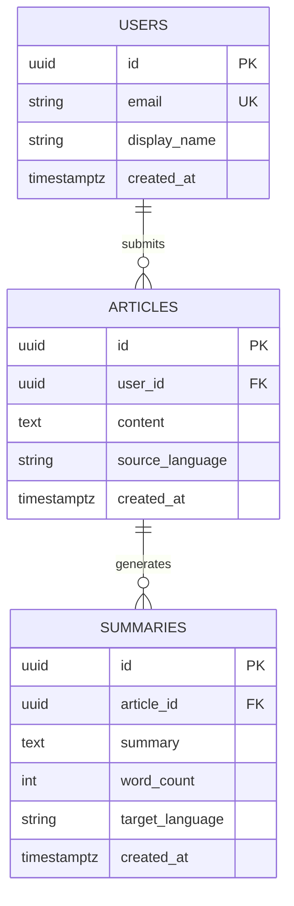

# Database Schema Template

> **Layer 2 spec（介面層）— 資料模型的合約**
> 大廠對標：**Migration-first**（Rails / Django / Prisma 慣例）+ **PostgreSQL 命名規範**（Mozilla / Heroku）
> 寫作時機：任何新增 table、欄位、index 時。**先寫 migration 計畫、後寫程式**。

---

## 1. 命名慣例（採 PostgreSQL community 慣例）

| 元素 | 規則 | 範例 |
|---|---|---|
| Table | 複數 snake_case | `users`、`news_articles`、`summary_jobs` |
| Column | 單數 snake_case | `created_at`、`user_id` |
| Primary key | `id`（uuid 或 bigserial） | `id` |
| Foreign key | `<table>_id` | `user_id`、`article_id` |
| Boolean | `is_*` / `has_*` | `is_active`、`has_verified_email` |
| Timestamp | `*_at`（不是 `*_time`） | `created_at`、`deleted_at` |
| Index | `idx_<table>_<columns>` | `idx_articles_created_at` |
| Unique | `uniq_<table>_<columns>` | `uniq_users_email` |

---

## 2. 標準欄位（每個 table 都該有）

```sql
id           UUID         PRIMARY KEY DEFAULT gen_random_uuid(),
created_at   TIMESTAMPTZ  NOT NULL DEFAULT NOW(),
updated_at   TIMESTAMPTZ  NOT NULL DEFAULT NOW(),
deleted_at   TIMESTAMPTZ  NULL                    -- soft delete
```

**為什麼 soft delete？** 用 `WHERE deleted_at IS NULL` 過濾，避免實體刪除導致參照失效。對小型專案可以省略，但建議從第一天就加。

---

## 3. ERD（Entity-Relationship Diagram）

用 Mermaid 畫，能直接在 GitHub / Notion 渲染：



---

## 4. Table Definitions

### `users`

```sql
CREATE TABLE users (
    id              UUID         PRIMARY KEY DEFAULT gen_random_uuid(),
    email           VARCHAR(255) NOT NULL,
    display_name    VARCHAR(100),
    is_active       BOOLEAN      NOT NULL DEFAULT TRUE,
    created_at      TIMESTAMPTZ  NOT NULL DEFAULT NOW(),
    updated_at      TIMESTAMPTZ  NOT NULL DEFAULT NOW(),
    deleted_at      TIMESTAMPTZ  NULL,

    CONSTRAINT uniq_users_email UNIQUE (email)
);

CREATE INDEX idx_users_created_at ON users (created_at);
CREATE INDEX idx_users_active ON users (is_active) WHERE deleted_at IS NULL;
```

**業務規則：**
- `email` 全域唯一
- `is_active = FALSE` 視為「停權」，仍可查詢
- 軟刪除：`deleted_at IS NOT NULL` 不出現在 list

---

## 5. Index Strategy

| 何時加 index | 例 |
|---|---|
| 外鍵欄位 | `idx_articles_user_id` |
| 高頻查詢的篩選欄位 | `idx_articles_status WHERE status = 'pending'` |
| 排序欄位 | `idx_articles_created_at DESC` |
| 複合查詢 | `idx_articles_user_status (user_id, status)` |

**反例：** 不要在 boolean 欄位加 index，效益極低（除非搭配 partial index）。

---

## 6. Migration Plan（採 Rails / Prisma 慣例）

每個變更一個 migration file，**檔名含 timestamp + 動詞**：

```
db/migrations/
├── 20260527_120000_create_users.sql
├── 20260527_130000_create_articles.sql
├── 20260527_140000_add_status_to_articles.sql
└── 20260527_150000_drop_unused_legacy_table.sql
```

**Migration 鐵律：**

1. **永不修改已 deployed 的 migration**（要改 → 寫新 migration）
2. **每個 migration 包含 up + down**（down 是回滾腳本）
3. **Breaking migration 要分兩步走：**
   - Step 1：加新欄位 / 雙寫 / 確認
   - Step 2：刪舊欄位（隔幾天 / 確認新欄位 OK 後）
4. **大表加欄位用 `DEFAULT NULL`**（不要 `DEFAULT <value>` — 會鎖表）

---

## 7. 資料生命週期

| 資料類別 | 保留策略 | 刪除方式 |
|---|---|---|
| User 資料 | 永久（除非使用者要求刪除） | GDPR-style anonymize |
| Article 原文 | 30 天 | 自動 cron |
| Summary 結果 | 90 天 | 自動 cron |
| Audit log | 1 年 | 歸檔到 cold storage |

---

## 8. Sensitive Data 標記

任何含 PII（個資）的欄位都要明確標記：

```sql
email        VARCHAR(255)  -- PII: email
phone        VARCHAR(20)   -- PII: phone, encrypted at rest
api_key      TEXT          -- SECRET: hashed (bcrypt)
```

對應 `docs/security.md` 的 PII 處理規則。

---

## 9. Backup & Recovery

- 每天全量 backup（保留 30 天）
- WAL 連續備份（point-in-time recovery）
- 每月驗證 backup 可還原（人工跑一次）

---

## 寫作檢查清單

- [ ] 所有 table 有 `id` + `created_at` + `updated_at`
- [ ] 軟刪除欄位 `deleted_at` 已加（或明確說不用）
- [ ] 命名遵守 snake_case + 複數 table
- [ ] 外鍵欄位都加了 index
- [ ] 列了 ERD（用 Mermaid）
- [ ] 每個 table 有業務規則說明
- [ ] Migration 計畫含 down script
- [ ] PII 欄位有標記
- [ ] 資料保留期限有明確規範
