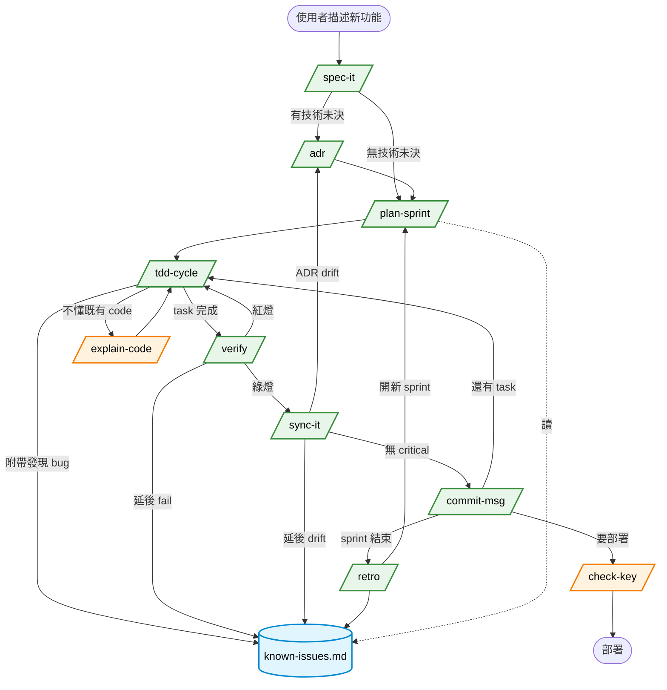
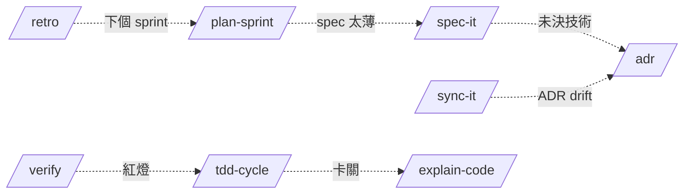

# SKILL-MAP — 所有 Skill 的互動與連動關係

> 完整盤點本模板 **10 個 skill** 的依賴、連動、孤兒分析。
> 對應 `WORKFLOW.md`（10 站工作流）：WORKFLOW 描述「順序」，本檔描述「相依與互動」。
> 更新時機：新增 / 刪除 skill、修改 skill 邏輯、發現新斷層。

---

## 1. 全部 Skills 一覽（10 個）

| # | Skill | 分類 | 主要用途 | 何時用 |
|---|---|---|---|---|
| 1 | `/explain-code` | Legacy | 架構師視角解釋既有 code（紅綠燈 + 導師教學） | 任何時候卡關 / 不懂 |
| 2 | `/check-key` | Legacy | 部署前掃 hardcoded secret / .gitignore 覆蓋 | 部署 / push 前 |
| 3 | `/spec-it` | 工程‹ | 生 PRD + API contract + BDD scenarios | 新功能動工前 |
| 4 | `/adr` | 工程‹ | 寫 Architecture Decision Record（MADR v3.0） | 重大技術選型時 |
| 5 | `/plan-sprint` | 工程‹ | 把 PRD 拆 sprint backlog | Sprint 開始 |
| 6 | `/tdd-cycle` | 工程‹ | Red-Green-Refactor TDD 循環 | 寫每個功能 |
| 7 | `/verify` | 工程‹ | 5 維度品質驗證（Format/Lint/Type/Test/Security） | Commit 前 |
| 8 | `/sync-it` | 工程‹ | Code↔docs drift 偵測 | Commit 前 / 改完 contract |
| 9 | `/commit-msg` | 工程‹ | Conventional Commits 生成 | Commit 時 |
| 10 | `/retro` | 工程‹ | Sprint 4Ls 回顧 | Sprint 結束 |

---

## 2. Pre/Post 條件矩陣

| Skill | Pre（前置條件） | Post（產出 / 後果） | 自動觸發下一個 |
|---|---|---|---|
| `/spec-it` | 使用者描述新功能 | `docs/PRD.md`、`docs/api-contract.md`、`tests/features/*.feature`、`tests/unit/test_*.py` 骨架、`tasks/backlog.md` 條目 | 建議 `/plan-sprint`（拆任務）或 `/adr`（若有未決技術選型） |
| `/adr` | 對話出現多技術選項比較 | `adr/ADR-NNNN-*.md` | （無自動下一步） |
| `/plan-sprint` | `docs/PRD.md` 存在 | `tasks/sprint-current.md`、`tasks/backlog.md` 重整 | 建議 `/tdd-cycle`（開始第一個 task） |
| `/tdd-cycle` | PRD + 測試骨架（`/spec-it` 產出） | code + 綠燈測試、`tasks/known-issues.md`（附帶 issue） | 建議 `/verify`（task 完成後） |
| `/verify` | 有 code 變更 | Verify report（Format/Lint/Type/Test/Security）、`tasks/known-issues.md`（延後的 fail） | 紅燈 → `/tdd-cycle`；綠燈 → `/sync-it` |
| `/sync-it` | code 改完 / 有 contract 變動 | Drift report、`tasks/known-issues.md`（延後的 drift）、可能觸發 `/adr`（若是 ADR drift） | 建議 `/commit-msg`（drift 處理完後） |
| `/commit-msg` | `/verify` 綠 + `/sync-it` 無 critical drift + staged changes | Commit | 建議下一個 `/tdd-cycle`（下個 task）或 `/retro`（sprint 結束） |
| `/retro` | Sprint goal 達成（sprint-current.md Now/Next 全 done） | `tasks/retros/YYYY-MM-DD-*.md`、`tasks/backlog.md`（Action Items） | 建議 `/plan-sprint`（開新 sprint） |
| `/explain-code` | 既有 code 存在 | 解釋輸出（不寫檔） | （無下一步，工具型 skill） |
| `/check-key` | 即將部署 / push | 安全報告 | 通過 → 部署；失敗 → 修 |

---

## 3. 完整 Sprint 流程圖（典型路徑）



---

## 4. 6 種典型路徑（Use Case）

### Path A：完整 Sprint（理想路徑）

```
/spec-it → [/adr ×0-3] → /plan-sprint → /tdd-cycle × N → /verify → /sync-it → /commit-msg → /retro → (next /plan-sprint)
```

每個新 feature 都跑這條。Sprint 結束自然過渡到下個 sprint。

### Path B：修 Bug

```
/tdd-cycle（先寫能重現 bug 的失敗測試）→ /verify → /sync-it → /commit-msg
```

不需要 `/spec-it`（bug 是已有功能的偏離，不是新功能）；不需要 `/adr`（除非修法涉及架構變更）。

### Path C：架構重大調整

```
/adr（寫新 ADR superseded 舊的）→ /sync-it（讓 code 對齊新決策）→ /tdd-cycle（補測試）→ /verify → /commit-msg
```

例：原本用 React 想換 Vue。先寫 ADR-0010 superseded ADR-0002，再讓 code 跟。

### Path D：學員卡關

```
（在 /tdd-cycle 過程中）→ /explain-code（解釋既有 code）→ 繼續 /tdd-cycle
```

`/explain-code` 是「中斷工具」，不影響主線流程。

### Path E：純文件整理 / Refactor

```
/sync-it（找出所有 drift）→ /verify（確認重構沒破壞測試）→ /commit-msg
```

無 spec 變動的純整理。不需要 `/spec-it` `/tdd-cycle`。

### Path F：部署前

```
/verify（5 維度都過）→ /check-key（部署前最後一道 secret 掃描）→ deploy.md prompt 跑 → 部署
```

`/check-key` 是「部署前的雙保險」，與 `/verify §5 Security` 有重疊但更聚焦 secret 與 .gitignore。

---

## 5. 依賴關係表（誰讀誰寫）

| Skill | 讀（依賴的檔案 / 上游 skill 產出） | 寫（產出 / 影響的檔案） |
|---|---|---|
| `/spec-it` | （新功能描述） | `docs/PRD.md`、`docs/api-contract.md`、`tests/features/*.feature`、`tests/unit/test_*.py`、`tasks/backlog.md` |
| `/adr` | `docs/PRD.md`（檢查是否已涵蓋）、`adr/`（找下個編號） | `adr/ADR-NNNN-*.md` |
| `/plan-sprint` | `docs/PRD.md`、`tasks/backlog.md`、`tasks/known-issues.md`（review 未解決問題） | `tasks/sprint-current.md`、`tasks/backlog.md` |
| `/tdd-cycle` | `docs/PRD.md`、`tests/features/*.feature`、`tests/unit/test_*.py` 骨架 | code、tests、`tasks/known-issues.md`（附帶 issue） |
| `/verify` | 全 codebase + config（Makefile / package.json） | Verify report（stdout）、`tasks/known-issues.md`（延後 fail） |
| `/sync-it` | `docs/`、`adr/`、`tests/features/`、code | Drift report、`tasks/known-issues.md`（延後 drift） |
| `/commit-msg` | `git diff --cached`、`docs/PRD.md`（補 IMPACT 段） | Git commit |
| `/retro` | git log、`tasks/sprint-current.md`、`tasks/known-issues.md` | `tasks/retros/YYYY-MM-DD-*.md`、`tasks/backlog.md`（Action Items） |
| `/explain-code` | 既有 code | （只輸出解釋） |
| `/check-key` | code + `.env` + `.gitignore` | 安全報告（stdout） |

---

## 6. 識別的邏輯斷層（10 處）

掃描全部 skill 互動後，識別以下斷層。**✅ 已修 / ⚠️ 待修 / 🔄 持續觀察**：

| # | 斷層 | 影響 | 狀態 | 修法 |
|---|---|---|---|---|
| a | `/check-key` 與 `/verify §5 Security` 重疊掃 hardcoded key | 學員不知道何時用哪個 | ✅ 已修 | `/check-key` 定位為 deploy 前雙保險；`/verify §5` 引導「部署再跑 `/check-key`」 |
| b | `/explain-code` 從未被任何 Vibe Engineering skill 引用（孤兒） | 學員卡關時不知該打 `/explain-code` | ✅ 已修 | `/tdd-cycle` 加「使用者問『為什麼這樣寫』時建議 `/explain-code`」 |
| c | `/sync-it` 發現 ADR drift 但沒明確說「打 `/adr` 寫 superseded」 | 學員不知道怎麼處理 ADR drift | ✅ 已修 | `/sync-it` Step 5 加「ADR drift → 觸發 `/adr` 寫新 ADR」 |
| d | `/commit-msg` 後沒「下一步」指引 | 學員 commit 完不知道該幹嘛 | ✅ 已修 | `/commit-msg` 加「下一步建議」段（下個 task / sprint 結尾 / 部署） |
| e | `/retro` 結束後沒明確過渡到下個 `/plan-sprint` | sprint 之間斷掉、Action Items 容易遺忘 | ✅ 已修 | `/retro` Step 6 加「自動建議跑 `/plan-sprint`」 |
| f | `/spec-it` 沒檢查「PRD 有未決技術選型」就結束 | 學員寫完 PRD 沒人提醒寫 ADR | ✅ 已修 | `/spec-it` Step 6 加「掃 PRD 未決技術 → 建議 `/adr`」 |
| g | `/plan-sprint` 沒 review `tasks/known-issues.md` | 上個 sprint 延後的 issue 永遠不被排程 | ✅ 已修 | `/plan-sprint` Step 1 加「先讀 known-issues、列待排候選」 |
| h | `prompts/` 與 `skills/` 的取捨沒明說 | 學員混用、不知 Mode A 用 prompts 還是 skills | ✅ 已修 | `USAGE.md` FAQ 補一題說明 |
| i | `WORKFLOW.md` 沒納入 `/explain-code` 與 `/check-key` | Legacy skill 在 Vibe Engineering 流程中位置不明 | ✅ 已修 | `WORKFLOW.md` 加「Path D 卡關」+「Path F 部署前」兩條輔助路徑 |
| j | `tasks/known-issues.md` 寫得進去但沒有 skill 定期 review | issue 累積但永遠不被處理 | ✅ 已修 | `/plan-sprint` 與 `/retro` 都加 review 步驟 |

---

## 7. 孤兒 Skill 分析（修補前 vs 修補後）

### `/explain-code`

| 維度 | 修補前 | 修補後 |
|---|---|---|
| 何時觸發 | 只有使用者主動打 `/explain-code` | + `/tdd-cycle` 過程使用者問「為什麼」時自動建議 |
| 在 WORKFLOW.md 的位置 | 完全沒提到 | Path D「卡關情境」明確列出 |
| 與 Vibe Engineering skill 的關係 | 完全脫節 | 與 `/tdd-cycle` 雙向：卡關 → 暫停 → `/explain-code` → 繼續 |

### `/check-key`

| 維度 | 修補前 | 修補後 |
|---|---|---|
| 何時觸發 | 只有 `prompts/deploy.md` 提到 | + `/verify §5 Security` 後引導「部署再跑 `/check-key`」 |
| 與 `/verify` 的關係 | 功能重疊但定位不清 | 明確分工：`/verify` 是「commit 前掃」、`/check-key` 是「部署前掃」（覆蓋面更廣） |
| 在 WORKFLOW.md 的位置 | 完全沒提到 | Path F「部署前」明確列出 |

---

## 8. 雙向關係 / 回頭路徑

某些 skill 不是單向，會回頭觸發前序 skill：



**回頭情境** = 表示「上游 skill 沒處理完 / 出現新發現」。不是失敗，是合理的工作流分支。

---

## 9. Skill 觸發優先序（更新版）

依 `rules/07-proactive-skill-trigger.md`，**多個 skill 同時匹配時的優先序**：

| 優先級 | Skill | 條件 |
|---|---|---|
| 1 | `/verify` | 即將 commit / push 之前 |
| 2 | `/sync-it` | `/verify` 過了但有檔案改動未同步文件 |
| 3 | `/spec-it` | 沒 PRD / 沒 BDD scenarios 就想寫 code |
| 4 | `/adr` | 對話中出現多個技術選項在比較（且 PRD 未涵蓋） |
| 5 | `/plan-sprint` | 有 PRD 但沒 sprint-current.md / 條目都打勾完 |
| 6 | `/tdd-cycle` | 有 spec 但要寫 code 前 |
| 7 | `/explain-code` | 使用者問「為什麼」「這在做什麼」（任何階段） |
| 8 | `/check-key` | 即將部署 / push 到 public repo 前 |
| 9 | `/commit-msg` | 一切都綠、要 commit 時 |
| 10 | `/retro` | sprint 結束跡象（所有 Now/Next 條目都 done） |

---

## 10. 維護鐵律

1. **新增 skill 時**：必須在本檔案 §1 §2 §5 §6 加一行；如有依賴須在 §3 流程圖加 node
2. **刪除 skill 時**：必須先檢查 §5 依賴關係表，移除前替換所有引用
3. **修改 skill 主邏輯時**：對照 §2 Pre/Post 矩陣，確認上下游 skill 不會受影響
4. **發現新斷層時**：加到 §6 表格、優先標 ⚠️ 待修
5. **每 3 個月人工 review 一次**：確認所有 skill 都還在使用、無新孤兒
6. **更新 `rules/07-proactive-skill-trigger.md` 時**：同步更新本檔 §9 觸發優先序

---

## 11. 快速速查

**「使用者剛說 ___，我該建議哪個 skill？」**

| 使用者說 | 建議 skill |
|---|---|
| 「我想做 ___」「加 ___ 功能」 | `/spec-it` |
| 「用 X 還是 Y」「___ vs ___」（PRD 沒涵蓋時） | `/adr` |
| 「sprint 開始」「拆任務」「這禮拜做什麼」 | `/plan-sprint` |
| 「實作 ___」「寫 ___ 功能」「修 ___ bug」 | `/tdd-cycle` |
| 「這段 code 在幹嘛」「為什麼這樣寫」 | `/explain-code` |
| 「準備 commit」「跑完了」「都做完了」 | `/verify` |
| 「我改了 API / schema」「文件還對嗎」 | `/sync-it` |
| 「commit」「寫 message」「準備 push」 | `/commit-msg` |
| 「要部署了」「push 到 GitHub」 | `/check-key` |
| 「sprint 結束」「回顧」「學到什麼」 | `/retro` |

---

## 12. 心法

> **Skill 不是越多越好。每個 skill 必須在系統內有明確位置、有上游有下游、不能是孤兒。**

> **Sprint 流程 = 連結所有 skill 的脊椎。一個 skill 沒在 Sprint 流程中找到自己的位置 → 它就是孤魂野鬼。**

> **修補斷層比新增 skill 重要。**
