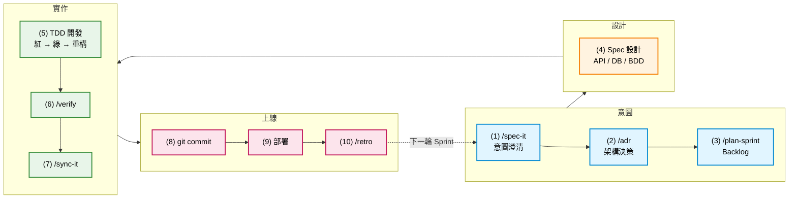

# Solo SDD Sprint Workflow

> 給一個人 + AI 的「精簡版 Scrum + Spec-Driven Development」工作流。
> 適合：有基礎程式概念、想用 AI 認真做專案的學員。
> 心法：**Spec 先寫、TDD 紅綠燈、Doc 跟著 code 走**。

---

## 一輪 Sprint 的 10 站



### 每站要做什麼

| # | 站 | 觸發 skill | 主要產出 | 大廠對標 |
|---|---|---|---|---|
| 1 | 意圖澄清 | `/spec-it` | `docs/PRD.md` + acceptance criteria | Atlassian Product Spec / Amazon PR-FAQ |
| 2 | 架構決策 | `/adr` | `adr/ADR-NNNN-*.md` | MADR v3.0（ThoughtWorks Tech Radar） |
| 3 | Backlog 拆解 | `/plan-sprint` | `tasks/backlog.md` 條目 | Atlassian Jira / Linear |
| 4 | Spec 設計 | `/spec-it`（生 Layer 2+3） | `docs/api-contract.md` / `docs/db-schema.md` / `tests/*.feature` | OpenAPI 3.0 + Stripe Errors + Gherkin |
| 5 | TDD 開發 | `/tdd-cycle` | code + 綠燈測試 | Kent Beck Red-Green-Refactor + AAA pattern |
| 6 | 驗證 | `/verify` | lint + test + coverage 報告 | Google testing on toilet（test pyramid） |
| 7 | 文件同步 | `/sync-it` | 更新 `docs/PRD.md` / `docs/api-contract.md` | Doc-as-Code（Stripe / Twilio） |
| 8 | Commit & Push | `/commit-msg` | conventional commit + push | Conventional Commits 1.0 |
| 9 | 部署 | `prompts/deploy.md` | preview URL / 上線 | 12-factor app |
| 10 | Retro | `/retro` | `tasks/retros/YYYY-MM-DD.md` | 4Ls retrospective format |

---

## SDD 的 3 層 Spec

Spec 不是一坨大文件，是分層描述：

| Layer | 名稱 | 寫什麼 | 大廠範本 |
|---|---|---|---|
| **L1 意圖層** | PRD / User Story | 解什麼問題、誰用、成功長什麼樣 | `docs/templates/PRD-template.md`、`user-story-template.md` |
| **L2 介面層** | API contract / DB schema | 系統邊界的合約 | `docs/templates/api-contract-template.md`、`db-schema-template.md` |
| **L3 行為層** | BDD scenario / 測試案例 | 行為對不對的判定條件 | `docs/templates/bdd-scenarios-template.md`、`test-cases-template.md` |

**鐵律**：
- L1 永遠要寫（不寫等於沒方向）
- L2 有 API / DB 就要寫（沒寫等於 AI 亂猜介面）
- L3 主流程 + 邊界 case 一定寫（沒寫等於沒人能驗收）

---

## 兩個輔助路徑（Legacy Skill 在 SDD 流程中的位置）

10 站是主線。另外兩個 legacy skill 是**輔助路徑**，可以在任何 SDD 階段插入：

### Path D：學員卡關（任何階段都可插入）

```
[正在跑某 SDD skill] → 卡住「為什麼這樣寫」「看不懂這段 code」
                    ↓
                   /explain-code（架構師視角 + 紅綠燈 + 導師教學）
                    ↓
                   懂了 → 回到原本的 SDD skill 繼續
```

**何時觸發**：使用者在 `/tdd-cycle` 過程問「為什麼這樣寫」「我看不懂」「這在做什麼」。
**特性**：中斷工具，不影響主線流程。

### Path F：部署 / push 前（在站 9 部署之前）

```
站 8 /commit-msg ─→ 站 9 部署
                       ↑
                       └─ 先跑 /check-key（部署前 secret 雙保險）
```

**何時觸發**：使用者說「我要部署」「push 到 GitHub」「上 Vercel」。
**與 `/verify §5 Security` 的分工**：
- `/verify §5` = commit 前每次跑（基本掃描）
- `/check-key` = 部署前最後一道（涵蓋更廣的 secret pattern + .gitignore 覆蓋 + 環境變數 + git history）

### Skill 連動完整圖

完整 10 個 skill 的相依與互動關係見 [`SKILL-MAP.md`](./SKILL-MAP.md)：
- 10 個 skill 的 Pre/Post 矩陣
- 6 種典型路徑（A 完整 / B 修 bug / C 重大調整 / D 卡關 / E refactor / F 部署）
- 識別的 10 個邏輯斷層與修補狀態
- 觸發優先序與雙向關係

---

## Sprint 起跑檢查清單

開新 sprint 前，確認你能回答以下 5 題：

- [ ] 這個 sprint 結束時，**外人能看到什麼**？（具體 demo 情境）
- [ ] 你寫好 `docs/PRD.md` 第 1-3 節了嗎？
- [ ] 你拆好 `tasks/sprint-current.md` 了嗎？（每個任務半天能完成）
- [ ] 你寫好至少 1 個 BDD scenario 了嗎？（讓 AI 知道驗收長怎樣）
- [ ] 你 commit & push 過上一個 sprint 的成果了嗎？

5 題都打勾才開始動 code。**這 30 分鐘的紀律會省下 5 小時的返工**。

---

## 一句話心法

> **Spec 是你給 AI 的合約；TDD 是你給自己的證明；Doc 是你給未來自己的解說。**

三者缺一，AI 就會變成「看起來很有用、實際亂寫一通」的同事。
