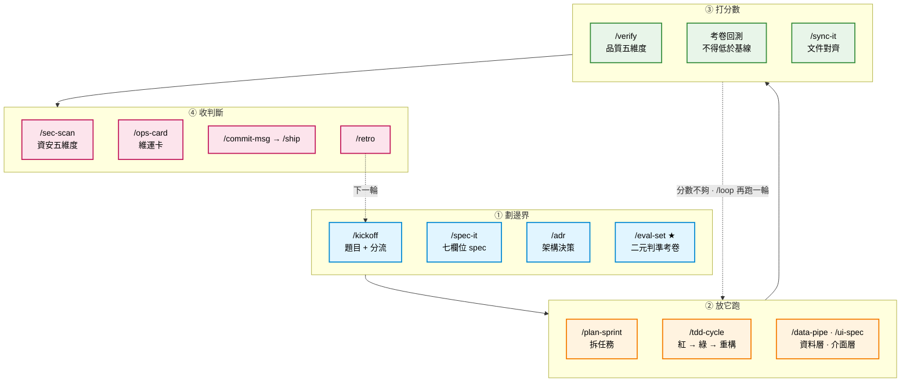

# WORKFLOW — 從意圖到交付

> 一個人 + Claude Code 的完整開發流程。
> **心法**：沒有評分函式不開跑；跑起來就讓它跑完；收工由人決定。

---

## 全圖

**注意那條虛線回頭箭頭。** 那是循環工程和一次性開發的唯一差別：
分數不夠時你回到②再跑一輪，而不是說服自己「這樣應該可以了」。

---

## 每一站

| # | 拍 | 站 | Skill | 產出 |
|---|---|---|---|---|
| 1 | ① | 題目與分流 | `/kickoff` | `decision-card.md` |
| 2 | ① | 意圖結構化 | `/spec-it` | `docs/PRD.md`（七欄位） |
| 3 | ① | 架構決策 | `/adr` | `adr/ADR-NNNN-*.md` |
| 4 | ① | **建考卷** ★ | `/eval-set` | `evals/eval-set.md` + 基線 |
| 5 | ② | 拆任務 | `/plan-sprint` | `tasks/sprint-current.md` |
| 6 | ② | 實作 | `/tdd-cycle` | code + 綠燈測試 |
| 7 | ② | 資料層 | `/data-pipe` | `docs/db-schema.md` + 驗證 |
| 8 | ② | 介面層 | `/ui-spec` | `docs/ui/*.md` + 六種狀態 |
| 9 | ③ | 品質驗證 | `/verify` | 五維度報告 |
| 10 | ③ | 考卷回測 | 跑 `evals/` | 通過率 vs 基線 |
| 11 | ③ | 文件對齊 | `/sync-it` | drift 清單 |
| 12 | ④ | 資安 | `/sec-scan` | 阻擋項清單 |
| 13 | ④ | 維運 | `/ops-card` | `docs/OPS.md` |
| 14 | ④ | 交付 | `/commit-msg` → `/ship` | 上線 |
| 15 | ④ | 回顧 | `/retro` | `tasks/retros/*.md` |

**第 4 站是最容易被跳過、也最不該跳過的一站。**
沒有考卷，第 10 站就沒東西可比，整個迴圈退化成「改一改感覺好像好了」。

---

## 四條鐵則

| 鐵則 | 規則 | 違反的後果 |
|---|---|---|
| **沒評分不開跑** | `rules/08` | 無法證明有進步 |
| **沒 spec 不寫 code** | `rules/04` | AI 自由發揮，改 10 次 |
| **沒測試不算完成** | `rules/05` | 不敢重構，專案僵化 |
| **沒 `/verify` 不 commit** | — | 壞的東西進主線 |

---

## 三層 spec

Spec 不是一坨大文件，是分層的：

| Layer | 寫什麼 | 什麼時候一定要寫 |
|---|---|---|
| **L1 意圖** | PRD / user story —— 解什麼問題、誰用、成功長什麼樣 | **永遠** |
| **L2 介面** | API contract / DB schema —— 系統邊界的合約 | 有 API 或 DB 時 |
| **L3 行為** | BDD scenario / 測試案例 —— 對不對的判定條件 | **永遠**（主流程 + 邊界） |

範本在 `skills/spec-it/templates/`（6 份）與 `skills/adr/templates/`（1 份）。

---

## 規模縮放（不必全用）

| 你要做的 | 跑哪些 | 大約 |
|---|---|---|
| 改 typo / 樣式 | 直接改 | — |
| 修一個 bug | `/tdd-cycle`（先寫重現測試）→ `/verify` | 30 分 |
| 半天小功能 | `/spec-it`（精簡）→ `/tdd-cycle` → `/verify` → `/commit-msg` | 4 小時 |
| 一天完整功能 | 加 `/eval-set` + `/sync-it` | 8 小時 |
| 一週專案 | 全套 15 站 | — |

**判斷標準**：有沒有**行為改變**。有 → 走流程；純樣式 → 直接改。

---

## 起跑檢查（5 題）

開一輪新迴圈前，確認你答得出來：

- [ ] 這一輪結束時，**外人能看到什麼**？
- [ ] 「做對了」怎麼判斷？**寫得出程式檢查嗎**？
- [ ] 這一輪只准動哪些檔案？
- [ ] 跑幾輪就停？
- [ ] 上一輪的東西 commit 了嗎？

**第 2 題答不出來 → 先跑 `/eval-set`，不要開工。**

---

## 一句話

> **Spec 是你給 AI 的合約；考卷是你給自己的證明；維運卡是你給接手者的解說。**
